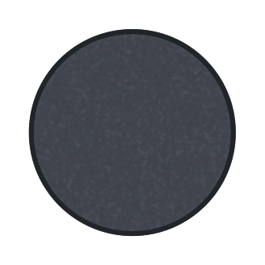

# July 2-3: Setup Cart Functionality

I started getting the cannon setup in Godot and made some starter art. 

Lapses: 
- https://lapse.hackclub.com/timelapse/6EN1qiNve6Au
- https://lapse.hackclub.com/timelapse/D7JpNGuNZPmq

*Total time: 5.3 hours*

# July 5-6: Setup Cannon Functionality

I made a cannon ball asset and coded shooting functionallity. I used @export so I can theoretically change the projectile later when I add potions (note to self find a way to mass produce potion art). I also added a progress/cooldown bar to shoot how much you have charged it and the cooldown time left.

Lapses:  I forgot to lapse :sob:

*Total time: ~2 hours*

# July 7: Planning and bad levels

I planned the some of the story and gameplay for the game. I also tried to make a level using polygons but that didn't really work out.

Lapses: 
- https://lapse.hackclub.com/timelapse/SM58ZaeaP-oB

*Total time: 1.35 hours*

# July 8: Start Da Art

I began drawing a lot of the major assets for the game. I decided to redraw the things I made in illustrator using Adobe Fresco. It works really well and it helped me make smooth vector assets. It took me a while because I've never done much art or used Fresco, but overall I think they came out great.

My original assets used godot scale to look right, this time I decided on making art in scenes (ex. 1980 x 1020 large canvas). This way I could make each asset in a layer (or layer group) and export them each as a texture that I can easy drop into the game.

Lapse: I used my Ipad and afaik I can't lapse it

*Total time: ~5 hours*

# July 9: Potions and Ear-rape

In the morning I failed to make some villian music for the game. I came back later and make a couldron art, and a pedistal. To fill out the potion room I made a wood background inspired by mc spruce wood and my already existing wood texture. I also decided to make a gold frame and a vectorized photo of my cat.

Then, I tried to make a crown for the cat but I decided a jester hat would be more fitting. The hat looked weird on the cat (freaking docter seuss) so I decided to make it the logo for the evil organization C.L.O.W.N., I also PAINSTACKING drew letters matching the hat. I really need to work on the actual game art instead of just making art for side areas 🥀🥀🥀 

Lapse: 
- Potion art was done on Ipad again (~4.5 hrs)
- https://lapse.hackclub.com/timelapse/jx8N_QSKtF98

*Total Time: ~4.9 hours*